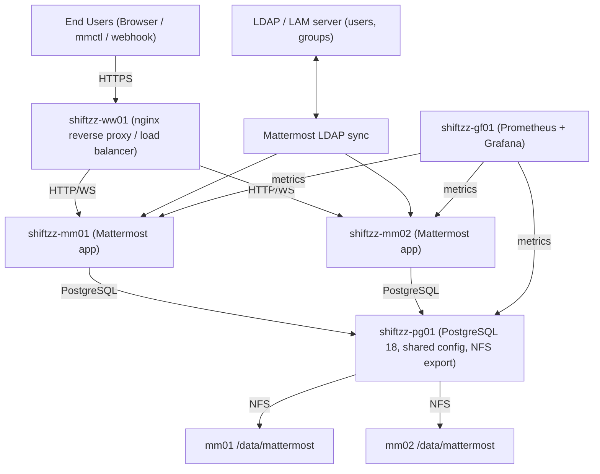

# Mattermost Enterprise Installation (HA)  
**Technical Documentation**

Author:		Joachim Baumgartner, Applicant for the position "Technical Account Manager, Germany"
Date:		15/04/2026

---

## 1. Overview

This document describes the setup of a **Mattermost Enterprise (v11.5.1)** environment in a **high availability (HA)** configuration. A production-like HA setup has been built and three real customer use cases have been validated: LDAP integration, monitoring/observability, and external integrations via webhooks — including troubleshooting edge cases like WebSocket handling and LDAP group resolution. 

Additionally, the document describes a typical common pattern encountered by support engineers, the number of `Total Sessions` displayed in the system console's section `Site Statistics`

---

## 2. Target Architecture

### Components

- Reverse Proxy (nginx)
- Application Servers (2x Mattermost nodes)
- PostgreSQL database
- Shared storage (NFS) located on Postgres server and exported to application servers
- Monitoring (Prometheus + Grafana)
- LDAP + LAM (LDAP Account Manager)

---


## 2.1 Hosts Overview

```text
+----------------+----------------------+--------------------------------------+
| Host           | Role                 | Main Services                        |
+----------------+----------------------+--------------------------------------+
| shiftzz-ww01   | Reverse Proxy        | nginx, TLS termination, LB           |
| shiftzz-mm01   | Mattermost Node 1    | Mattermost app, metrics endpoint     |
| shiftzz-mm02   | Mattermost Node 2    | Mattermost app, metrics endpoint     |
| shiftzz-pg01   | Database / NFS       | PostgreSQL 18, NFS server, exporters |
| shiftzz-gf01   | Monitoring           | Prometheus, Grafana                  |
| ldap / lam host| Directory Services   | OpenLDAP, LAM                        |
+----------------+----------------------+--------------------------------------+
```

## 2.2 Architectural Overview



## 2.3 Network Overview

```text
REAL / PUBLIC NETWORK
=====================

 Internet / Public DNS
        |
        +--> mattermost.shiftzz.net  ---> public entry point on shiftzz-ww01 (89.167.125.101)
        | 
        +--> grafana.shiftzz.net     ---> public entry point on shiftzz-ww01 (89.167.125.101)
        | 
        +--> lam.shiftzz.net         ---> public entry point on shiftzz-ww01 (89.167.125.101)


PRIVATE VLAN / INTERNAL NETWORK
===============================

 172.16.200.0/28

 +----------------+----------------+----------------------------------+
 | IP             | Host           | Purpose                          |
 +----------------+----------------+----------------------------------+
 | 172.16.200.2   | shiftzz-ww01   | reverse proxy                    |
 | 172.16.200.3   | shiftzz-mm01   | Mattermost node 1                |
 | 172.16.200.4   | shiftzz-mm02   | Mattermost node 2                |
 | 172.16.200.5   | shiftzz-pg01   | PostgreSQL + NFS + DB exporters  |
 | 172.16.200.6   | shiftzz-gf01   | Prometheus + Grafana             |
 | 172.16.200.7   | shiftzz-ld01   | user and group LDAP service      |
 +----------------+----------------+----------------------------------+

Traffic separation:

 Public side:
   users --> HTTPS --> shiftzz-ww01

 Internal side:
   shiftzz-ww01 --> mm01/mm02                (HTTP / WebSocket proxying)
   mm01/mm02   --> pg01                      (PostgreSQL)
   mm01/mm02   --> pg01                      (NFS shared storage)
   gf01        --> mm01/mm02/pg01            (Prometheus scraping)
   mm01/mm02   --> LDAP server               (LDAP auth / group sync)
```

## 3. Infrastructure Setup

- Hetzner hosts provisioned
- Private VLAN (172.16.200.0/28)
- DNS:
  - mattermost.shiftzz.net
  - grafana.shiftzz.net
  - lam.shiftzz.net

---

## 4. Reverse Proxy (nginx)
- Mattermost configuration
```nginx
upstream shiftzz-mm-cluster {
  server shiftzz-mm01:8065;
  server shiftzz-mm02:8065;
}
[...]
ssl_certificate /etc/ssl/shiftzz/live/crt/star_shiftzz.net-ssl.crt;
ssl_certificate_key /etc/ssl/shiftzz/live/key/star_shiftzz.net-ssl.key;
[...]
location ~ /api/v[0-9]+/(users/)?websocket$ {
       proxy_set_header Upgrade $http_upgrade;
       proxy_set_header Connection "upgrade";
       client_max_body_size 100M;
       proxy_set_header Host $host;
       proxy_set_header X-Real-IP $remote_addr;
       proxy_set_header X-Forwarded-For $proxy_add_x_forwarded_for;
       proxy_set_header X-Forwarded-Proto $scheme;
       proxy_set_header X-Frame-Options SAMEORIGIN;
       proxy_buffers 256 16k;
       proxy_buffer_size 16k;
       client_body_timeout 60s;
       send_timeout 300s;
       lingering_timeout 5s;
       proxy_connect_timeout 90s;
       proxy_send_timeout 300s;
       proxy_read_timeout 90s;
       proxy_http_version 1.1;
       proxy_pass http://shiftzz-mm-cluster;
   }
[...]
location / {
       client_max_body_size 100M;
       proxy_set_header Connection "";
       proxy_set_header Host $host;
       proxy_set_header X-Real-IP $remote_addr;
       proxy_set_header X-Forwarded-For $proxy_add_x_forwarded_for;
       proxy_set_header X-Forwarded-Proto $scheme;
       proxy_set_header X-Frame-Options SAMEORIGIN;
       proxy_buffers 256 16k;
       proxy_buffer_size 16k;
       proxy_read_timeout 600s;
       proxy_http_version 1.1;
       proxy_pass http://shiftzz-mm-cluster;
   }
```
- Grafana configuration
```nginx
server {
   listen 443 ssl http2;
   listen [::]:443 ssl http2;
   server_name    grafana.shiftzz.net;
[...]
  ssl_certificate /etc/ssl/shiftzz/live/crt/star_shiftzz.net-ssl.crt;
  ssl_certificate_key /etc/ssl/shiftzz/live/key/star_shiftzz.net-ssl.key;
[...]
 location / {
      proxy_pass http://shiftzz-gf01:3000;
      proxy_set_header Host $host;
      proxy_set_header X-Real-IP $remote_addr;
      proxy_set_header X-Forwarded-For $proxy_add_x_forwarded_for;
      proxy_set_header X-Forwarded-Proto $scheme;
   }
[...]
  location /prometheus/ {
      proxy_pass http://shiftzz-gf01:9090/;
      proxy_set_header Host $host;
      proxy_set_header X-Real-IP $remote_addr;
      proxy_set_header X-Forwarded-For $proxy_add_x_forwarded_for;
      proxy_set_header X-Forwarded-Proto $scheme;
   }
```

---

## 5. Database

PostgreSQL 18 with dedicated DB and user.

---

## 6. Shared Storage

NFS mounted on both application nodes.

---

## 7. Application Layer

Mattermost 11.5.1 Enterprise installed on both nodes.

---

## 8. Configuration Management

- config.json migrated to DB
- environment-based configuration

---

## 9. High Availability

Active-active cluster with shared DB + storage.

---

## 10. LDAP Integration (Detailed Configuration)

### 10.1 Mattermost LDAP Configuration

Configured via:  
**System Console → Authentication → LDAP**

### Connection Settings

- LDAP Server: internal LDAP host
- Port: 389
- Connection Security: None
- Bind Username: cn=admin,dc=shiftzz,dc=net

---

### User Configuration

User Base DN:
ou=users,dc=shiftzz,dc=net

User Filter:
(objectClass=inetOrgPerson)

---

### Group Configuration

Group Base DN:
ou=groups,dc=shiftzz,dc=net

Group Filter:
(objectClass=groupOfNames)

Group Member Attribute:
member

User ID Attribute:
uid

Group Display Name Attribute:
cn

---

### Attribute Mapping

| Mattermost Field | LDAP Attribute |
|-----------------|----------------|
| Username        | uid            |
| First Name      | givenName      |
| Last Name       | sn             |
| Email           | mail           |

---

### Synchronization

- Sync result:
  Scanned 16 LDAP users and 1 groups

- Users authenticate via LDAP
- Group mention works (@bosses)

---

### Result

- LDAP fully functional
- Central identity management working

---

## 11. Monitoring

Prometheus + Grafana with exporters.

---

## 12. Incoming Webhook

Configured and tested successfully.

---

## 13. Custom Analysis: Total Sessions

Calculated via direct SQL query.

---

## 14. Task: Creating incoming web hook and post to a specific channel
- check that `System Console -> Integrations -> Integration Management -> Enable Incoming Webhooks` has been set to `true`
- create a Mattermost channel
```
mmctl channel create \
   --team shiftzz \
   --name incoming-webhook \
   --display-name "Incoming Webhook" \
```
- navigate to `Integrations -> Incoming Webhooks` and search for your newly created web hook. Note down the URL to it, example:
```
https://mattermost.shiftzz.net/hooks/awy35srwhpbu8fuwzq37ojmx4h
```
- create a shell script to send a message to that channel:
```
ravanello:07_code joachim$ cat send_to_webhook.sh
#!/usr/bin/env bash

webHookURL="https://mattermost.shiftzz.net/hooks/awy35srwhpbu8fuwzq37ojmx4h"

curl -i -X POST -H 'Content-Type: application/json' \
   -d '{"text": "Hello, this is our test of the incoming webhook text\nThis is even more text. 🎉"}' $webHookURL
```
- run that shell script, the result should look something like this:
```
ravanello:07_code joachim$ ./send_to_webhook.sh
HTTP/2 200
server: nginx/1.24.0 (Ubuntu)
date: Wed, 15 Apr 2026 10:41:20 GMT
content-type: text/plain
content-length: 2
permissions-policy:
referrer-policy: no-referrer
vary: Accept-Encoding
x-content-type-options: nosniff
x-request-id: t7p9wjwkntrbte9riq9uztbway
x-version-id: 11.5.1.22760374792.d754341ba50d27031db69feb10faf5479d2f87b96d384ea958950c2eac5dc0b2.true
strict-transport-security: max-age=15768000
```
- check the channel in the Mattermost UI

---

## 15. Task: Incident Simulation Task "Total Sessions"
This task is to document the ways to find out how the number shown in the panel `Total Sessions` in `System Console -> Site Statistics` is being calculated. There are three ways:

### 15.1 Ask the developer
That seems to be the easiest way to achieve that issue, but it shows only laziness. 

### 15.2 Have a look at the database schema of the Mattermost application
- connect to the database
```
postgres@shiftzz-pg01:~$ psql -d mattermost;
psql (18.3 (Ubuntu 18.3-1.pgdg24.04+1))
Type "help" for help.

mattermost=#
```
- look for tables names containing the name `session`
```
mattermost=# \d pg_tables;
              View "pg_catalog.pg_tables"
   Column    |  Type   | Collation | Nullable | Default
-------------+---------+-----------+----------+---------
 schemaname  | name    |           |          |
 tablename   | name    |           |          |
 tableowner  | name    |           |          |
 tablespace  | name    |           |          |
 hasindexes  | boolean |           |          |
 hasrules    | boolean |           |          |
 hastriggers | boolean |           |          |
 rowsecurity | boolean |           |          |
```
```
mattermost=# select schemaname, tablename, tableowner, tablespace from pg_tables where tablename like '%session%';
 schemaname |   tablename    | tableowner | tablespace
------------+----------------+------------+------------
 public     | sessions       | mattermost |
 public     | calls_sessions | mattermost |
 public     | uploadsessions | mattermost |
(3 rows)
```
- show structure of table `sessions` (that name sounds promising)
```
mattermost=# \d public.sessions;
                         Table "public.sessions"
     Column     |          Type          | Collation | Nullable | Default
----------------+------------------------+-----------+----------+---------
 id             | character varying(26)  |           | not null |
 token          | character varying(26)  |           |          |
 createat       | bigint                 |           |          |
 expiresat      | bigint                 |           |          |
 lastactivityat | bigint                 |           |          |
 userid         | character varying(26)  |           |          |
 deviceid       | character varying(512) |           |          |
 roles          | character varying(256) |           |          |
 isoauth        | boolean                |           |          |
 props          | jsonb                  |           |          |
 expirednotify  | boolean                |           |          |
Indexes:
    "sessions_pkey" PRIMARY KEY, btree (id)
    "idx_sessions_create_at" btree (createat)
    "idx_sessions_expires_at" btree (expiresat)
    "idx_sessions_last_activity_at" btree (lastactivityat)
    "idx_sessions_token" btree (token)
    "idx_sessions_user_id" btree (userid)
```
- select all sessions where `expiresat > 0`
```
mattermost=# select id,expiresat,userid,roles from public.sessions where expiresat > 0;
             id             |   expiresat   |           userid           |          roles
----------------------------+---------------+----------------------------+--------------------------
 hggh4czgab8ofjz4gko65c111o | 1778782673326 | nftj778wktbkxe79uc7h3ozxsa | system_user system_admin
 ejmw5eqbrt8fbxibawroptm1ey | 1778838226544 | nftj778wktbkxe79uc7h3ozxsa | system_user system_admin
 1phhthfdpfbp7pnw6m5g5pwjsh | 4929778137132 | nftj778wktbkxe79uc7h3ozxsa | system_user system_admin
 ```
 - count them:
```
mattermost=# select count(*) as "total sessions" from public.sessions where expiresat > 0;
 total sessions
----------------
              3
(1 row)
```

### 15.3 Analyze the code (help of `AI` is appreciated here)
- Start from the text shown in the UI
- The label is “Total Sessions” in System Console → Reporting → Site Statistics.
- Search the codebase for that string
- In the Mattermost source, UI labels usually map to `i18n` keys. Searching for “Total Sessions” (or its i18n key) leads to the React admin console code.
- Follow the frontend → backend wiring. The admin console fetches site statistics via the REST API (the analytics endpoint). From there, it becomes clear the value comes from the backend analytics service.
- Trace the backend handler. The handler calls into the server’s analytics layer (analytics.go), which exposes session_count.
- Follow the store layer. That call goes into the SQL store, where AnalyticsSessionCount() runs the `COUNT(*) FROM Sessions WHERE ExpiresAt > now` query.

So the path is:
UI label → frontend code → API endpoint → backend analytics → store method → SQL query

The actual calculation is done in this file:
```
server/channels/store/sqlstore/session_store.go:

func (me SqlSessionStore) AnalyticsSessionCount() (int64, error) {
        var count int64
        query :=
                `SELECT
                        COUNT(*)
                FROM
                        Sessions
                WHERE ExpiresAt > ?`
        if err := me.GetReplica().Get(&count, query, model.GetMillis()); err != nil {
                return int64(0), errors.Wrap(err, "failed to count Sessions")
        }
        return count, nil
}
```

---

## 16. Result

Fully functional HA Mattermost environment.

---

## Appendix A: `/etc/hosts` entry on each server
```
# internal VLAN
172.16.200.2 shiftzz-ww01
172.16.200.3 shiftzz-mm01
172.16.200.4 shiftzz-mm02
172.16.200.5 shiftzz-pg01
172.16.200.6 shiftzz-gf01
172.16.200.7 shiftzz-ld01
```

---

## Appendix B: installation of components on DB server

- add postgres repositories and keyrings and install PG18 server
```
sh -c 'echo "deb http://apt.postgresql.org/pub/repos/apt $(lsb_release -cs)-pgdg main" > \
   /etc/apt/sources.list.d/pgdg.list'
curl -fsSL https://www.postgresql.org/media/keys/ACCC4CF8.asc | \
   sudo gpg --dearmor -o /etc/apt/trusted.gpg.d/postgresql.gpg

apt-get update && apt-get install postgresql-18
```
- modify postgresql.conf:
```
listen_addresses = '172.16.200.5'
port = 5432
[...]
log_timezone = 'localtime'
```

- modify `pg_hba.conf`
```
# allow connections from MM hosts shiftzz-mm01/shiftzz-mm02 and grafana exporter on localhost
host    mattermost        mattermost         172.16.200.3/32    scram-sha-256
host    mattermost        mattermost         172.16.200.4/32    scram-sha-256
host    postgres          exporter           172.16.200.5/32    scram-sha-256
```
- create users, tablespace and database for Mattermost
```
postgres@shiftzz-pg01:~$ psql
psql (18.3 (Ubuntu 18.3-1.pgdg24.04+1))
Type "help" for help.

postgres=# create user mattermost with password '********************';
postgres=# create user exporter with password '*********************';
postgres=# create tablespace ts_mattermost owner mattermost location '/data/postgres';
postgres=# create database mattermost with owner = 'mattermost' tablespace = 'ts_mattermost';
```
- install NFS-Server and export file system
```
root@shiftzz-pg01:~# apt-get install nfs-kernel-server
```
```
root@shiftzz-pg01:~# cat /etc/exports
/data/mattermost	shiftzz-mm01(rw,sync,no_subtree_check)
/data/mattermost	shiftzz-mm02(rw,sync,no_subtree_check)
```
```
root@shiftzz-pg01:~# systemctl reload nfs-kernel-server && exportfs
/data/mattermost
		shiftzz-mm01
/data/mattermost
		shiftzz-mm02
```
- create user mattermost:
```
root@shiftzz-pg01:~# useradd -c "Mattermost Admin" -d /var/lib/mattermost -m -s /bin/bash mattermost
```
- create directories and change ownership
```
root@shiftzz-pg01:~# ls -l /data/mattermost/
total 12
drwxrwxr-x 2 mattermost mattermost 4096 Mar 31 11:11 config
drwxrwxr-x 4 mattermost mattermost 4096 Mar 31 14:16 mmdata
drwxrwxr-x 2 mattermost mattermost 4096 Mar 31 12:25 archive
```

---
## Appendix C: installation of components on App servers shiftzz-mm01 and shiftzz-mm02:

- create user mattermost:
```
 root@shiftzz-pg01:~# useradd -c "Mattermost Admin" -d /var/lib/mattermost -m -s /bin/bash mattermost

```
- install NFS client, create mountpoint and add entry to /etc/fstab:
```
apt-get install nfs-common
mkdir -p /data/mattermost
echo "shiftzz-pg01:/data/mattermost /data/mattermost nfs defaults 0 0" >> /etc/fstab
mount /data/mattermost
```
- switch to user mattermost and download the latest version
```
mattermost@shiftzz-mm01:/data/mattermost/archive$ curl -o mattermost-11.5.1-linux-amd64.tar.gz \
   https://releases.mattermost.com/11.5.1/mattermost-11.5.1-linux-amd64.tar.gz
```
- unpack the TAR ball into /opt/mattermost:
```
mattermost@shiftzz-mm01:~$ ls -lL /opt/mattermost
total 708
drwxr-xr-x 2 mattermost mattermost   4096 Mar 31 13:48 bin
drwxr-xr-x 8 mattermost mattermost  45056 Mar 31 13:53 client
drwxr-xr-x 2 mattermost mattermost   4096 Mar 31 14:16 config
-rw-r--r-- 1 mattermost mattermost   2046 Mar  6 12:29 ENTERPRISE-EDITION-LICENSE.txt
drwxr-xr-x 2 mattermost mattermost   4096 Mar  6 12:29 fonts
drwxr-xr-x 2 mattermost mattermost   4096 Mar  6 12:29 i18n
drwxr-xr-x 2 mattermost mattermost   4096 Mar 31 14:15 logs
-rw-r--r-- 1 mattermost mattermost    439 Mar  6 12:29 manifest.txt
-rw-r--r-- 1 mattermost mattermost 628816 Mar  6 12:29 NOTICE.txt
drwxr--r-- 8 mattermost mattermost   4096 Mar 31 14:16 plugins
drwxr-xr-x 2 mattermost mattermost   4096 Mar  6 12:29 prepackaged_plugins
-rw-r--r-- 1 mattermost mattermost   7566 Mar  6 12:29 README.md
drwxr-xr-x 2 mattermost mattermost   4096 Mar  6 12:29 templates
```
- Edit `/opt/mattermost/config/config.json:`
```
[...]
        "EnableAPIUserDeletion": true,
[...]
        "FileLocation": "/var/log/mattermost"
[...]
        "EnableLocalMode": true,
[...]
 "SqlSettings": {
        "DriverName": "postgres",
        "DataSource": "postgres://********:********@********-********/mattermost? \
                       sslmode=disable\u0026connect_timeout=10\u0026binary_parameters=yes",
[...]
 "EmailSettings": {
 "FeedbackName": "Mattermost shiftzz",
  "FeedbackEmail": "mattermost@shiftzz.net",
```
- Create systemd unit:
```
root@shiftzz-mm01:~# cat /usr/lib/systemd/system/mattermost.service
[Unit]
Description=Mattermost
After=network-online.target

[Service]
Type=notify
ExecStart=/opt/mattermost/bin/mattermost
TimeoutStartSec=3600
Restart=always
RestartSec=10
WorkingDirectory=/opt/mattermost
User=mattermost
Group=mattermost
LimitNOFILE=49152

[Install]
WantedBy=multi-user.target
```
- Link and reload:
```
root@shiftzz-mm01:/etc/systemd/system/multi-user.target.wants# ls -l mattermost.service
lrwxrwxrwx 1 root root 42 Mar 31 13:47 mattermost.service -> /usr/lib/systemd/system/mattermost.service

systemctl daemon-reload
```
- Start mattermost:
```
systemctl start mattermost.service
```
- navigate to mattermost.shiftzz.net, create first (admin) user and change the following settings in System Console
```
ENVIRONMENT -> Web Server -> Site URL: https://mattermost.shiftzz.net
ENVIRONMENT -> File Storage -> File Storage System: Local File System
ENVIRONMENT -> File Storage -> Local Storage Directory: /data/mattermost/mmdata

ENVIRONMENT -> SMTP -> SMTP Server: mail.shiftzz.net
ENVIRONMENT -> SMTP -> SMTP Server port: 25
ENVIRONMENT -> SMTP -> Enable SMTP Authentication: TRUE
ENVIRONMENT -> SMTP -> SMTP Server Username: joachim

COMPLIANCE -> Data Retention -> Create trial license
```
- login to the MM instance via mmctl:
```
mattermost@shiftzz-mm01:~$ /opt/mattermost/bin/mmctl auth login https://mattermost.shiftzz.net --name MMshiftzz --username joachim
Password:

  credentials for "MMshiftzz": "joachim@https://mattermost.shiftzz.net" stored


mattermost@shiftzz-mm01:~$ /opt/mattermost/bin/mmctl auth list

    | Active |      Name | Username |                    InstanceURL |
    |--------|-----------|----------|--------------------------------|
    |      * | MMshiftzz |  joachim | https://mattermost.shiftzz.net |
```
- move config.json to database:
```
/opt/mattermost/bin/mmctl config migrate \
   /opt/mattermost/config/config.json "postgres://********:********@********-********:********/mattermost?sslmode=disable&connect_timeout=10" --local
```
- check result in DB:
```
postgres@shiftzz-pg01:~$ psql
psql (18.3 (Ubuntu 18.3-1.pgdg24.04+1))
Type "help" for help.

postgres=# \c mattermost
You are now connected to database "mattermost" as user "postgres".
mattermost=# SELECT * FROM Configurations WHERE Active=true;
```
- create environment file for systemd and add it to systemd unit, reload daemon afterwards (bootstrapping database connection)
```
[Unit]
Description=Mattermost
After=network-online.target

[Service]
Type=notify
ExecStart=/opt/mattermost/bin/mattermost
TimeoutStartSec=3600
Restart=always
RestartSec=10
WorkingDirectory=/opt/mattermost
User=mattermost
Group=mattermost
LimitNOFILE=49152
EnvironmentFile=/opt/mattermost/config/mm_environment.txt

[Install]
WantedBy=multi-user.target
```
- Add the following to the environment file (metric settings for later use set individually for each host):
```
root@shiftzz-mm01:~# cat /opt/mattermost/config/mm_environment.txt
MM_CONFIG='postgres://********:********@********-********:********/mattermost?sslmode=disable&connect_timeout=10'
MM_METRICSSETTINGS_LISTENADDRESS=172.16.200.3:8067
```
```
root@shiftzz-mm02:~# cat /opt/mattermost/config/mm_environment.txt
MM_CONFIG='postgres://********:********@********-********:********/mattermost?sslmode=disable&connect_timeout=10'
MM_METRICSSETTINGS_LISTENADDRESS=172.16.200.4:8067
```

- Start MM, get a temporary enterprise license (easiest via SystemConsole ->  Compliance -> Data Retention Policies) and enable and configure HighAvailability Mode

---

## Appendix D: installation of components on Server `shiftzz-gf01`:
- install node exporters on Mattermost app and DB servers
- install prometheus-postgres-exporter on DB server
- configure them to listen on private IP address:
```
root@shiftzz-mm01:/etc/default# cat prometheus-node-exporter
ARGS="--web.listen-address=172.16.200.3:9100"

root@shiftzz-mm02:/etc/default# cat prometheus-node-exporter
ARGS="--web.listen-address=172.16.200.4:9100"

root@shiftzz-pg01:/etc/default# cat prometheus-node-exporter
ARGS="--web.listen-address=172.16.200.5:9100"

root@shiftzz-pg01:/etc/default# cat prometheus-postgres-exporter
DATA_SOURCE_NAME='postgresql://********:********@********-********:********/postgres?sslmode=disable'
ARGS="--web.listen-address=172.16.200.5:9187 --no-collector.stat_bgwriter"
```
- install Prometheus and Grafana on the monitoring server 
- make them listen to private IP addresses
- Prometheus
```
[Unit]
Description=Monitoring system and time series database
Documentation=https://prometheus.io/docs/introduction/overview/ man:prometheus(1)
After=time-sync.target

[Service]
Restart=on-abnormal
User=prometheus
EnvironmentFile=/etc/default/prometheus
ExecStart=
ExecStart=/usr/bin/prometheus \
  --config.file=/etc/prometheus/prometheus.yml \
  --storage.tsdb.path=/var/lib/prometheus \
  --web.listen-address=172.16.200.6:9090
```
- Grafana
```
root@shiftzz-gf01:/etc/grafana > cat grafana.ini
[server]
protocol = http
http_addr = 172.16.200.6
http_port = 3000

domain = grafana.shiftzz.net
root_url = https://grafana.shiftzz.net/
serve_from_sub_path = false
```
- Configure Prometheus:
```
root@shiftzz-gf01:~ > cat /etc/prometheus/prometheus.yml
global:
  scrape_interval: 15s

scrape_configs:
  - job_name: 'mattermost'
    static_configs:
      - targets:
          - 'shiftzz-mm01:8067'
          - 'shiftzz-mm02:8067'

  - job_name: 'nodes'
    static_configs:
      - targets:
          - 'shiftzz-mm01:9100'
          - 'shiftzz-mm02:9100'
          - 'shiftzz-pg01:9100'
  - job_name: 'postgres-exporter'
    static_configs:
      - targets:
          - 'shiftzz-pg01:9187'
```
Log in to `grafana.shiftzz.net` and import the following three dashboards:
- 1860 (node exporters)
- 9628 (postgres DB)
- 15582 (Mattermost application)

---

## Appendix E: LDAP Server Structure

```
dc=shiftzz,dc=net
├── ou=users
└── ou=groups
```

Example user:

```
dn: uid=ian.tien,ou=users,dc=shiftzz,dc=net
objectClass: inetOrgPerson
uid: ian.tien
sn: Tien
givenName: Ian
mail: ian.tien@shiftzz.net
```

Example group:

```
dn: cn=bosses,ou=groups,dc=shiftzz,dc=net
objectClass: groupOfNames
cn: bosses
member: uid=ian.tien,ou=users,dc=shiftzz,dc=net
```

---

## Appendix F: LDIF scripts
- creating base structure:
```
root@shiftzz-ld01:~# cat base-structure.ldif
dn: ou=people,dc=shiftzz,dc=net
objectClass: top
objectClass: organizationalUnit
ou: people

dn: ou=groups,dc=shiftzz,dc=net
objectClass: top
objectClass: organizationalUnit
ou: groups
```
- creating class `groupOfNames`
```
root@shiftzz-ld01:~# cat g_mattermost_groupofnames.ldif
dn: cn=g_mattermost_sync,ou=groups,dc=shiftzz,dc=net
objectClass: top
objectClass: groupOfNames
cn: g_mattermost_sync
member: cn=John Doe,ou=people,dc=shiftzz,dc=net
```
- create LDAP users
```
root@shiftzz-ld01:~# cat mattermost-users.ldif
dn: cn=Ian Tien,ou=people,dc=shiftzz,dc=net
objectClass: top
objectClass: person
objectClass: organizationalPerson
objectClass: inetOrgPerson
objectClass: posixAccount
cn: Ian Tien
sn: Tien
givenName: Ian
uid: ian.tien
mail: ian.tien@shiftzz.net
uidNumber: 10001
gidNumber: 10000
homeDirectory: /home/ian.tien
loginShell: /bin/bash
userPassword: ******************

dn: cn=Corey Hulen,ou=people,dc=shiftzz,dc=net
objectClass: top
objectClass: person
objectClass: organizationalPerson
objectClass: inetOrgPerson
objectClass: posixAccount
cn: Corey Hulen
sn: Hulen
givenName: Corey
uid: corey.hulen
mail: corey.hulen@shiftzz.net
uidNumber: 10002
gidNumber: 10000
homeDirectory: /home/corey.hulen
loginShell: /bin/bash
userPassword: ******************
[...snip...]
```
- add users to group `g_mattermost_sync_members`
```
root@shiftzz-ld01:~# cat g_mattermost_sync_members.ldif
dn: cn=g_mattermost_sync,ou=groups,dc=shiftzz,dc=net
changetype: modify
replace: member
member: cn=John Doe,ou=people,dc=shiftzz,dc=net
member: cn=Ian Tien,ou=people,dc=shiftzz,dc=net
member: cn=Corey Hulen,ou=people,dc=shiftzz,dc=net
member: cn=Leigh Dow,ou=people,dc=shiftzz,dc=net
member: cn=Shigeru Harasawa,ou=people,dc=shiftzz,dc=net
member: cn=Matt Mandrgoc,ou=people,dc=shiftzz,dc=net
member: cn=Devanesan Moses,ou=people,dc=shiftzz,dc=net
member: cn=James Mullins,ou=people,dc=shiftzz,dc=net
member: cn=Ajay Uppaluri,ou=people,dc=shiftzz,dc=net
member: cn=Jason Blais,ou=people,dc=shiftzz,dc=net
member: cn=Daniel Schalla,ou=people,dc=shiftzz,dc=net
member: cn=Pavel Zeman,ou=people,dc=shiftzz,dc=net
member: cn=Linda Dalenberg,ou=people,dc=shiftzz,dc=net
member: cn=Lane McFarland,ou=people,dc=shiftzz,dc=net
member: cn=Kendra Niedziejko,ou=people,dc=shiftzz,dc=net
member: cn=Nirosha Ruwan,ou=people,dc=shiftzz,dc=net
```
- create bind user for Mattermost application:
```
root@shiftzz-ld01:~# cat mattermost-bind-user.ldif
dn: cn=mattermost-bind,ou=people,dc=shiftzz,dc=net
objectClass: top
objectClass: person
objectClass: organizationalPerson
objectClass: inetOrgPerson
cn: mattermost-bind
sn: bind
givenName: mattermost
uid: mattermost.bind
mail: mattermost.bind@shiftzz.net
userPassword: ******************
```

## Appendix G: LAM

- Web UI for LDAP administration
- Created 16 users and 1 group
- Managed via member attribute

---

## Appendix H: Key Learnings

- LDAP sync success ≠ visible users
- Users appear after initial login of each user
- Critical setting:
  Group Display Name Attribute = cn

---

